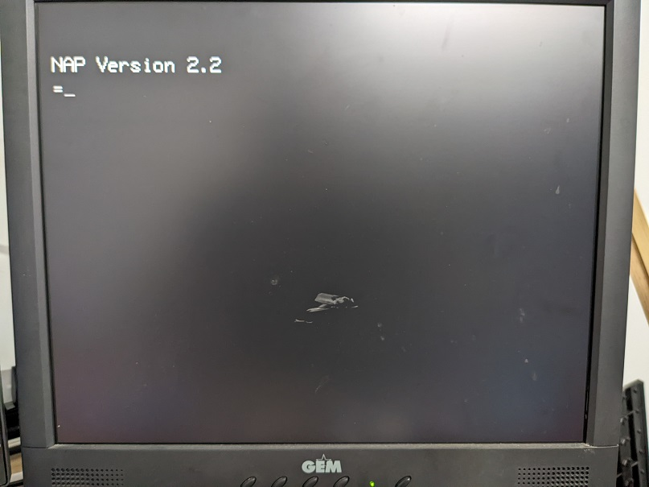
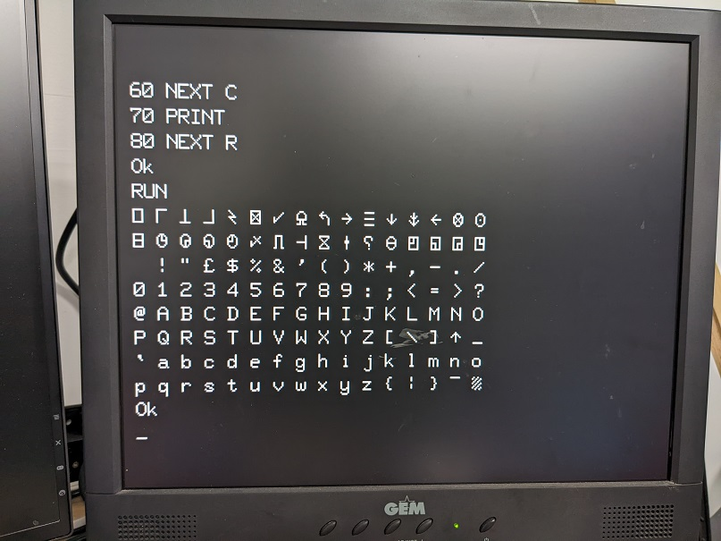

A hardware emulator for the Nascom-2 computer running on an ESP-32 with:
* VGA for display output
* PS/2 keyboard for input
* SD card reader for tape input/output

## History
The Nascom-2 was an early (1979) Z80 based micro.  Most machine were homebuilt from a kit: https://en.wikipedia.org/wiki/Nascom_(computer_kit)

The one I built 40+ years ago still runs!

## Specs
The specs of a typical machine:
* 4MHz Z80 (an 8080 compatible chip from Zilog)
* 8K static RAM on motherboard
* 64K dynamic RAM on extension board
* Cassette tape used for storage
* NAS-SYS monitor in ROM (2K) 
* Microsoft Basic in ROM (8K)

## Software
Lots of excellent software was written for this machine; including Assemblers/Disassemblers, Pascal editors/compilers, text formatters, games, etc.

The BLS Pascal compiler/editor deserves a special mention.  In my opinion, this is one of the most impressive pieces of software written. It was implemented by Anders Hejlsberg.  It is the origin of the Turbo Pascal and Delphi lineage of Pascal (-like) compilers and generates executable Z80 code. It allows code to be written with a full screen editor, which was a major leap in programmer productivity at the time. A welcome reprive from the line-by-line editing for Basic programs. The compiler and editor was implemented in **12K of code**. You'll be hard pressed to write a hello-world program and compile it into less code with today's 'modern' development environments.

An excellent resource/archive for software is Tommy Thorn's [nascomhomepage](http://www.nascomhomepage.com).

## Diagram

## Box
openSCAD was used to design a box, which can be printed on a 3D printer. I'm using the Creality Ender-3 printer, a very good budget printer (~$300).

I use openSCAD because doing the designs is much like writing code, so I don't have to step out of my comfort zone.

## Screenshots
**Boot Screen**

**Control Screen**

**Loading and running BLS Pascal**

**NAP Assembler**

**Microsoft Basic**

**nasForth**

Forth was also available on the Nascom-2.  Several implementations were made.  There's three (HullForth, nasForth, and T-Forth) on [nascomhomepage](http://www.nascomhomepage.com).  I've added nasForth to the permanent selection in the Internal Flash.

The Forth programming system had an innovative way of allowing the user to progressively develop their programs through compilation of word definitions and invocation of those definitions via a runtime interpreter.

With that said, I wouldn't recommend using Forth for anything substantial.  As a programming language, it has many drawbacks; mainly it's hard to write and read.  It took me many hours to get the PRIMES algorithm below working, and I even had a headstart, because I found some code on Youtube from [ForthFreak](https://www.youtube.com/watch?v=V5VGuNTrDL8).  I'm not a seasoned Forth programmer, though.  Not a Forth programmer at all, actually.  It is a great language, if you want to impress friends and colleagues with your mad obscure coding skills.

